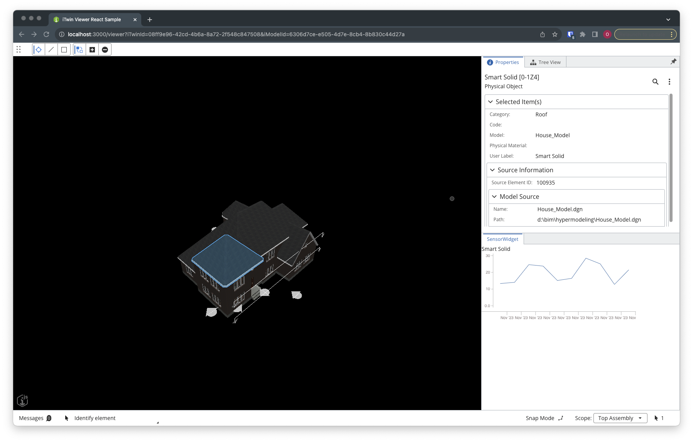
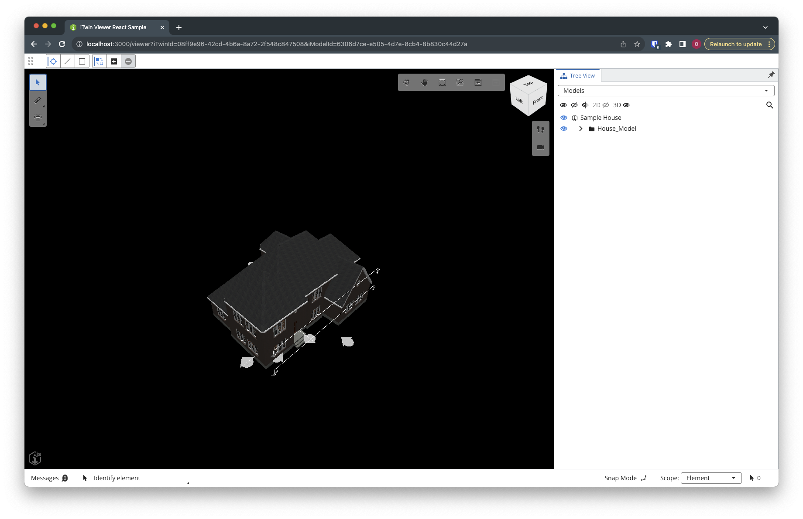
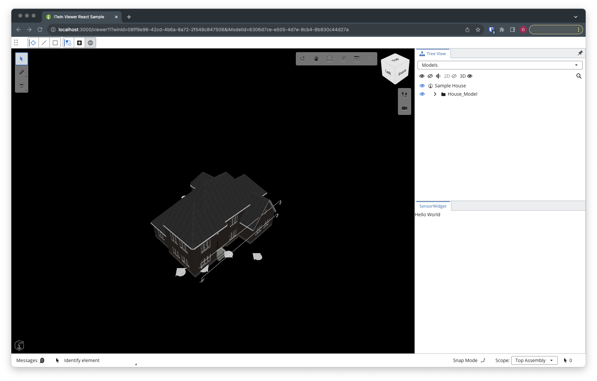

# Introduction

In this tutorial, we will learn how to use the iTwin Viewer with an HTTP endpoint that serves us sensor data. The final result will look like this:



# 1. Set up the Project
We are using the basic iTwin setup for this tutorial. Therefore, we are using the console in Visual Studio Code, browse ("cd ...") to the desired folder and type into the console: 

```bash
npx create-react-app sensor-itwin-tutorial --template @itwin/web-viewer --scripts-version @bentley/react-scripts
```

After the installation process is complete, we can either open the folder using Visual Studio Code or type into the console ``` cd sensor-itwin-tutorial``` to change the directory.

Next, we need to fill out the missing environment variables in our project's ".env" file. For more specifics, please go to [the iTwin Documentation](https://developer.bentley.com/tutorials/web-application-quick-start/).
As soon as everything is set up, we can start the application and test if everything is running smoothly by entering ```npm start```into the console. The result should look like this (after logging in with your account):



# 2. Setting up a UI Provider
We can extend iTwin with additional UI by adding custom-made UI Providers.
First of all, we need to create under the "src" folder a new file named "SensorWidgetProvider.tsx" and add an iTwin UIProvider to:

```typescript
// SensorWidgetProvider.tsx 

import {
	StagePanelLocation,
	StagePanelSection,
	UiItemsProvider,
	Widget,
	WidgetState,
} from "@itwin/appui-react";

export class SensorWidgetUiProvider implements UiItemsProvider {
	public readonly id: string = "SensorWidgetUiProvider";
	public provideWidgets(
	_stageId: string,
	_stageUsage: string,
	location: StagePanelLocation,
	_section?: StagePanelSection
	): ReadonlyArray<Widget> {
		const widgets: Widget[] = [];
		if (location === StagePanelLocation.Right) {
			widgets.push({
			id: "SensorWidget",
			label: "SensorWidget",
			defaultState: WidgetState.Open,
			content: <div>Hello World</div>,
			});
		}
		return widgets;
	}
}
```

Into the "content: " property, we are currently adding a placeholder with a simple Div and the text "Hello World". This is the place where we will later add our custom UI.

# 3. Adding the UI Provider to the Viewer
Next, we must tell iTwin that it should include our newly created UI provider. Therefore, we are switching to the file "App.tsx" and searching for the Viewer component (at the time of writing at line 148 of the current iTwin template). In there, we can find the property "uiProvider={[...]}" that includes a list of currently enabled UIs. We can add our UI by importing it at the top of the file.
```typescript
import { SensorWidgetUiProvider } from "./SensorWidgetProvider";
```
and adding the provider to the list in the Viewer component
```typescript

<Viewer
	iTwinId={iTwinId ?? ""}
	iModelId={iModelId ?? ""}
	changeSetId={changesetId}
	authClient={authClient}
	viewCreatorOptions={viewCreatorOptions}
	enablePerformanceMonitors={true} // see description in the README (https://www.npmjs.com/package/@itwin/web-viewer-react)
	onIModelAppInit={onIModelAppInit}
	uiProviders={[
		new SensorWidgetUiProvider(),
		new ViewerNavigationToolsProvider(),
		[...]
		]}
/>

```

The Application should now look this:



Keep in mind that the location of our UI widget may vary!

# 4. Displaying the selected element
First, we want to display the name of the element that is currently selected in the viewer. Therefore, we will create a new React Component (SensorWidget)) that we can use in the UI. In there, we are creating two state variables that host the name and the id of the selected element, establish a connection to the iModel in our Viewer and create a useEffect with a listener that is triggered as soon as something is selected in the Viewer. You can find all information regarding the iModelConncetion and the listener in the [iTwin Documentation](https://www.itwinjs.org/reference/core-frontend/imodelconnection/imodelconnection/). The code will look like the following:

```typescript
export function SensorWidget() {
	const [elementName, setElementName] = React.useState("");
	const [elementId, setElementId] = React.useState("");
	const iModelConnection = useActiveIModelConnection();
	React.useEffect(() => {
		iModelConnection?.selectionSet.onChanged.addListener((e) => {
			e.set.elements.forEach((element) => {
				iModelConnection?.elements.getProps(element).then((e) => {
				if (e[0].userLabel && e[0].id) {
					setElementId(e[0].id);
					setElementName(e[0].userLabel);
				}
				});
			});
		});
		return () => {
			iModelConnection?.selectionSet.onChanged.removeListener(() => {});
		};
		}, []);
	return (
	<div>
		<div>Element Name: {elementName}</div>
		<div>Element Id: {elementId}</div>
	</div>
	);
}
```

To see our changes in the application, we still need to replace the content in our Provider:

```typescript
content: <SensorWidget/>
```

# 5. Creating a HTTP service for the sensor data
To hook up our application to a service with sensor data, we first need to create this service. We will not go into the details on how this is specifically done since this was covered in an earlier seminar. But to ensure that we are all working with the same data, we will provide the code for the service here:

```python
from flask import Flask, request, jsonify
from datetime import datetime, timedelta
import random

app = Flask(__name__)

# Function to generate dummy timeseries data for a sensor
def generate_dummy_timeseries(num_entries=10):
    timeseries_data = []

    for i in range(num_entries):
        timestamp = (datetime.now() - timedelta(days=num_entries - i)).isoformat()
        value = round(random.uniform(10.0, 30.0), 2)  # Random sensor value between 10.0 and 30.0
        entry = [timestamp, value]
        timeseries_data.append(entry)

    return timeseries_data

# Function to add CORS headers manually
def add_cors_headers(response):
    response.headers['Access-Control-Allow-Origin'] = '*'  # Allow requests from any origin
    response.headers['Access-Control-Allow-Headers'] = 'Content-Type'
    response.headers['Access-Control-Allow-Methods'] = 'GET, POST'
    return response

@app.route('/project/<string:project_id>/sensor/<string:sensor_id>', methods=['GET', 'POST'])
def sensor(project_id, sensor_id):
    if request.method == 'GET':
        # Handle GET request, return dummy sensor data for the specified sensor_id
        response = jsonify({"data": generate_dummy_timeseries()})
        return add_cors_headers(response)

    elif request.method == 'POST':
        # Handle POST request, return the payload without storing anything
        payload = request.json
        timestamp = datetime.now().isoformat()
        payload["timestamp"] = timestamp
        response = jsonify({"data": payload})
        return add_cors_headers(response)

if __name__ == '__main__':
    app.run(debug=True)
```

You can set this server up yourself (e.g. by using pythonanywhere) or use the link provided during the seminar. The service is not creating any "real" data but is randomly generating it when it is queried. To GET information for a sensor (even though all routes are creating dummy data here) we need to use the following route (the {$value} parameters are variables and need to be replaced with specific IDs):

```
https://service-url/project/{$}/sensor/{$sensor_id}>
```

# 6. Connecting the iTwin with our service
In the next step, we want to load the sensor data for every element that we are clicking. For now, we are going to ignore that iTwin allows a multi-select, and we will always just use the first element if multiple are selected.

Before we start coding, we will need to install two additional modules to our project: "react-time-series-charts" and "pondjs". They are responsible for handling time series data (pondjs) and displaying it in our browser (react-time-series-charts).
We can install these with one console command (make sure you ended the current session of our application with ctrl+c in the console):
```bash
npm install react-timeseries-charts pondjs --save
```
Next, we need to import the following parts at the top of our file:
```typescript
import { TimeSeries } from "pondjs";
import {
Charts,
ChartContainer,
ChartRow,
YAxis,
LineChart,
}
//@ts-ignore
from "react-timeseries-charts";
```
We included the ```@ts-ignore```in our import to get rid of some Typescript errors. Now we are adding a new State in our SensorWidget that will store the sensor data that we load from our service:

```typescript
const [timeseries, setTimeseries] = React.useState<TimeSeries | null>(null);
```
And we will implement a new useEffect, that listens to changes in our elementId State. This means that this useEffect will always be triggered as soon as the state changes. In this useEffect, we will request the data from our service using fetch and save the requested data into our newly created State. It is good practice to simply copy and paste the URL to our service into the code but to "hide" it in the ".env" file. Therefore we first create ```IMJS_SENSOR_ENDPOINT="enter-service-url-here"``` in the .env file and restart the server (changes in the .env file will only take effect after a restart). The code for the second useEffect looks like this:
```typescript
React.useEffect(() => {
	if (elementId === "") {
		return;
	} else {
		const requestOptions: RequestInit = {
		method: "GET",
		redirect: "follow",
		};
		if (!process.env.IMJS_SENSOR_ENDPOINT) return;
		fetch(
			process.env.IMJS_SENSOR_ENDPOINT +
			"/project/project_1/sensor/" +
			elementId,
			requestOptions
		)
		.then((response) => response.json())
		.then((result) => {
			const datapoints = result["data"];
			const tempTimeseries = new TimeSeries({
				name: "sensor data",
				columns: ["index", "value"],
				points: datapoints,
			});
			setTimeseries(tempTimeseries);
		})
		.catch((error) => console.log("error", error));
	}
}, [elementId]);
```

# 7. Plotting the sensor data in react
The final step is to plot the sensor data in our application. Therefore we are using "react-timeseries-charts". If you want to go into the details of these charts, we suggest you read their [documentation](https://software.es.net/react-timeseries-charts/#/guide/intro). The chart uses the fetched time series data and is built on react components, that are placed inside our return() of of SensorWidget:

```typescript
export function SensorWidget() {
	return (
		<div>
			<div>Element Name: {elementName}</div>
			<div>Element Id: {elementId}</div>
			{timeseries === null ? (
				<></>
			) : (
			<ChartContainer
			timeRange={timeseries.timerange()}
			format="%b '%y"
			width={400}>						
				<ChartRow height="150">
					<YAxis
					id="value"
					label="Value"
					min={timeseries.min("value", () => {})}
					max={timeseries.max("value")}
					width="30"
					/>
					<Charts>
						<LineChart axis="value" series={timeseries} />
					</Charts>
				</ChartRow>
			</ChartContainer>
			)}
		</div>
	);
}
```

